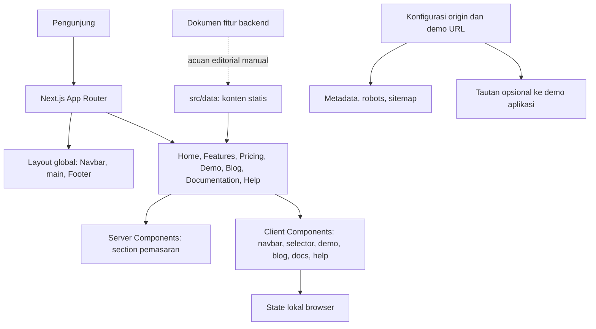
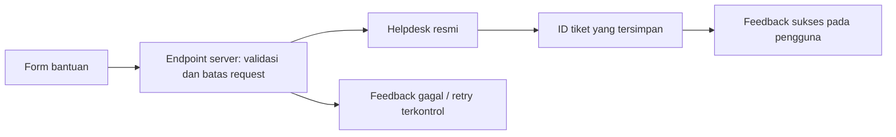

# Analisis Proyek dan Code Review NADI Billing

Tanggal review: **14 September 2026**  
Workspace: **D:\nadi-blling**  
Objek review: **nadi-billing-marketing**, versi aplikasi 0.1.0  
Status: **layak untuk preview internal; belum siap dipublikasikan sebagai layanan bantuan operasional**.

## 1. Ringkasan eksekutif

Fondasi website cukup baik: Next.js App Router, TypeScript strict, pemisahan data dan komponen, sebagian besar halaman dirender di server, serta pengujian E2E yang berjalan. Lint, typecheck, build produksi, dan tujuh skenario E2E lolos pada review ini. Audit npm untuk dependensi produksi melaporkan nol kerentanan yang diketahui registry saat pemeriksaan.

Masalah paling penting justru berada pada perilaku dan kebenaran informasi:

1. Formulir bantuan menyatakan tiket berhasil diterbitkan, padahal tidak mengirim atau menyimpan tiket.
2. Pusat bantuan menampilkan uptime, latency, dan status normal dari konstanta lokal sebagai status operasional.
3. Klaim payment gateway, WhatsApp gateway, serta otomasi isolir/reconnect masih tampil, bertentangan dengan dokumen sumber fitur di workspace.
4. Nomor dukungan, janji respons, statistik komunitas, dan beberapa klaim hasil belum memiliki bukti persetujuan atau pengukuran di workspace.
5. Pengujian tambahan menemukan masalah fokus modal, struktur ARIA navigasi, tab kategori, dan landmark dokumentasi yang tidak dicakup suite bawaan.

Laporan ini mencatat **14 temuan: 4 P1, 6 P2, dan 4 P3**. Sebagian merupakan bug terverifikasi; sebagian merupakan risiko arsitektur atau klaim yang memerlukan konfirmasi. Tidak ditemukan P0 dalam lingkup review ini. Label tersebut adalah prioritas proyek, bukan skor kerentanan keamanan.

Dokumen analisis yang terbaca pada awal review menyatakan penyelarasan sudah 100% akurat dan menganggap status UI sebagai telemetri aktual. Kesimpulan tersebut tidak didukung kode yang diperiksa. Kelulusan tes juga tidak membuktikan kepatuhan WCAG seluruh situs.

## 2. Lingkup, metode, dan batasan

### Lingkup yang diperiksa

- Inventaris 50 file dalam `src/`, sekitar 4.885 baris, serta satu file E2E berisi tujuh skenario.
- Routing, layout, metadata, konfigurasi build, dependensi, komponen interaktif, data konten, dan bagian pemasaran terkait klaim fitur.
- Dokumen `task.md`, `README.md`, catatan Stitch, serta tiga dokumen sumber fitur.
- Build produksi lokal dan pemeriksaan Chrome headless pada tujuh halaman utama.
- Enam lebar viewport: 360, 390, 768, 1024, 1280, dan 1600 px.
- Audit axe pada halaman awal, dropdown terbuka, dan modal artikel; pemeriksaan keyboard, pengiriman formulir, penolakan clipboard, dan URL artikel.

### Batasan penting

- **Backend Laravel, database, API operasional, dan infrastruktur ISP tidak tersedia di workspace ini.** Klaim RBAC, isolasi tenant, idempotensi invoice, audit immutable, atau integrasi perangkat hanya dapat dibandingkan dengan dokumen yang disertakan, bukan diverifikasi ulang terhadap implementasi backend.
- Folder ini tidak memiliki repository Git yang dapat dibaca: `git status` menghasilkan “not a git repository”. Review dilakukan terhadap snapshot filesystem; tidak ada analisis commit, branch, atau diff historis.
- Tidak dilakukan deployment, pengiriman pesan ke kontak dukungan, transaksi pembayaran, atau pengujian perangkat ISP nyata.
- Audit npm memakai `--omit=dev`; hasil nol temuan bukan jaminan keamanan seluruh aplikasi maupun audit seluruh tool pengembangan.
- Tidak ada pengukuran Core Web Vitals lapangan, load test, uji Safari/Firefox, maupun pengujian manual dengan screen reader. Angka kinerja produksi tidak disimpulkan dari kecepatan build.
- Kode aplikasi tidak diperbaiki dalam pekerjaan ini. Perubahan yang diminta adalah laporan; script dan hasil pemeriksaan tambahan tersedia sebagai artefak lokal di `test-results/`.

### Kategori bukti

| Label | Arti |
| --- | --- |
| Terverifikasi | Dibuktikan dari kode dan/atau reproduksi lokal |
| Risiko arsitektur | Pola kode sudah ada; dampak pertumbuhan atau operasional masih berupa risiko |
| Perlu konfirmasi | Informasi bisnis/produk tidak dapat dipastikan dari workspace |
| Kesiapan rilis | Pekerjaan lanjutan yang bisa disengaja pada fase preview, bukan otomatis bug |

## 3. Arsitektur yang benar-benar ada

### Stack

| Lapisan | Kondisi aktual |
| --- | --- |
| Framework | Next.js 16.3.4 menurut lockfile lokal |
| UI | React dan React DOM 19.3.0 menurut lockfile lokal |
| Bahasa | TypeScript 5.9.3; `strict: true` |
| Styling | Tailwind CSS v4, token CSS global, banyak utility class pada JSX |
| Konten | Array/objek TypeScript dalam `src/data/`, ditambah copy yang langsung ditulis pada komponen |
| Interaksi | React state lokal; tidak ada state manager global |
| Pengujian | Playwright 1.63.0 dan axe Playwright 4.13.0 |
| Runtime review | Node.js 22.14.0; npm 10.9.2; Windows PowerShell |
| Backend situs | Tidak ditemukan Route Handler API, Server Action untuk tiket, database, atau SDK pengiriman pesan |

Nomor versi di atas berasal dari dependency yang terkunci di workspace, bukan klaim tentang versi terbaru di internet.

### Aliran render dan data



Tidak ada aliran pengiriman dari formulir tiket menuju backend dalam arsitektur saat ini. Dokumen fitur JSON juga tidak diimpor oleh aplikasi atau tes untuk mengendalikan klaim yang tampil.

### Peta route dan rendering

| Kelompok | Route | Perilaku |
| --- | --- | --- |
| Pemasaran utama | `/`, `/features`, `/pricing` | Prerender statis, komponen section digunakan kembali |
| Simulasi | `/demo` | Render dinamis karena membaca query parameter; alur dan kapasitas memakai allowlist |
| Sumber daya | `/blog`, `/documentation`, `/help` | Halaman statis dengan interaksi client; metadata `noindex, follow` |
| Halaman sekunder | Empat `/solutions/*`, `/integrations`, `/developers` | `generateStaticParams` melalui catch-all; seluruhnya `noindex` |
| Metadata | `/robots.txt`, `/sitemap.xml` | Bergantung pada `NEXT_PUBLIC_SITE_URL` |
| Alias | `/harga`, `/fitur`, `/solusi/*`, dan alias sumber daya | Redirect permanen dari konfigurasi Next.js |
| Tidak dikenal | Route yang tidak cocok dengan data | `notFound()` |

Build melaporkan **18/18 keluaran statis berhasil dihasilkan**. Angka ini tidak berarti ada 18 halaman produk lengkap atau 18 fitur backend.

### Penilaian arsitektur

**Cocok untuk ukuran proyek sekarang.** Satu aplikasi Next.js dengan konten lokal sudah memadai untuk website pemasaran. Belum ada alasan teknis untuk memecahnya menjadi microservices atau menambah database hanya demi halaman statis.

Pemisahan antara website pemasaran dan aplikasi operasional perlu dibuat eksplisit. Jika tiket sungguhan diaktifkan, tambahkan integrasi server yang kecil dan terukur ke sistem helpdesk. Jangan menjadikan browser situs pemasaran sebagai penghubung langsung ke router, RADIUS, atau database pelanggan.

Batas Client Component perlu dipersempit pada halaman sumber daya. Seluruh `BlogExplorer`, `DocViewer`, dan `HelpCenter` beserta impor kontennya berada di sisi client, walaupun banyak isinya hanya teks statis. Client Components tetap dapat diprerender; masalahnya adalah jumlah kode/data yang juga dikirim dan dihidrasi. Rekomendasi ini mengikuti [dokumentasi Server dan Client Components Next.js](https://nextjs.org/docs/app/getting-started/server-and-client-components).

## 4. Bagian yang sudah baik

- TypeScript strict dan tipe eksplisit untuk data pemasaran mengurangi kesalahan integrasi dasar.
- Struktur `app / components / data / lib / types` mudah dipahami.
- Section utama digunakan kembali oleh halaman fitur dan harga.
- Metadata terpusat di `src/lib/metadata.ts`; origin yang belum diisi tidak diganti dengan domain fiktif.
- Parameter alur dan kapasitas demo dicocokkan dengan daftar nilai yang diketahui.
- Demo menyatakan bahwa simulasi tidak memproses pembayaran, mengirim pesan, atau mengakses data pelanggan.
- FAQ memakai elemen native `details/summary`, tidak bergantung pada JavaScript untuk membuka jawaban.
- Tersedia skip link, atribut bahasa Indonesia, indikator fokus global, dan aturan reduced motion.
- Tidak ditemukan `dangerouslySetInnerHTML`, evaluasi skrip dari input pengguna, atau fetch API operasional dalam source yang ditinjau.
- `poweredByHeader` dinonaktifkan; konfigurasi image SVG memuat pembatasan tersendiri.
- Pengujian awal tujuh halaman pada enam viewport tidak menemukan horizontal overflow dokumen.
- Harga nominal belum dibuat-buat; README menjelaskan bahwa tarif masih menunggu kepastian.

## 5. Daftar temuan

### Definisi prioritas

| Prioritas | Penanganan |
| --- | --- |
| P0 | Insiden kritis atau kompromi aktif; tidak ditemukan dalam review ini |
| P1 | Selesaikan sebelum publikasi karena dapat menyesatkan atau menggagalkan kebutuhan penting pengguna |
| P2 | Perbaiki pada iterasi terdekat untuk aksesibilitas, reliabilitas, dan pencegahan regresi |
| P3 | Perbaikan terjadwal untuk ketahanan dan kejelasan penggunaan |

### Ringkasan temuan

| ID | Prioritas | Temuan | Status bukti |
| --- | --- | --- | --- |
| F01 | P1 | Tiket bantuan sukses tanpa pengiriman | Terverifikasi di browser dan kode |
| F02 | P1 | Metrik statis dipresentasikan sebagai status layanan aktual | Terverifikasi |
| F03 | P1 | Klaim fitur bertentangan dengan sumber fitur yang disertakan | Terverifikasi terhadap dokumen lokal |
| F04 | P1 | Kontak dan janji komersial belum terverifikasi | Perlu konfirmasi |
| F05 | P2 | Modal blog tidak memenuhi perilaku keyboard modal | Terverifikasi di browser |
| F06 | P2 | Dropdown navigasi memakai struktur ARIA menu yang tidak valid | Terverifikasi dengan axe |
| F07 | P2 | Filter kategori memakai peran tab tanpa perilaku tab | Terverifikasi di browser dan kode |
| F08 | P2 | Dokumentasi memiliki main bersarang | Terverifikasi dengan axe |
| F09 | P2 | Suite QA belum mencakup area yang memuat bug utama | Terverifikasi |
| F10 | P2 | Konten tersebar dan komponen client terlalu banyak tanggung jawab | Risiko arsitektur |
| F11 | P3 | Konfigurasi URL demo yang malformed dapat melempar error | Terverifikasi pada ekspresi parser |
| F12 | P3 | Kegagalan clipboard tidak ditangani | Terverifikasi lewat simulasi penolakan |
| F13 | P3 | Entity HTML tampil mentah dalam dokumentasi | Terverifikasi di browser |
| F14 | P3 | Tombol pada ilustrasi produk tidak mempunyai aksi | Terverifikasi dari kode |

### F01 — Formulir bantuan memberi keberhasilan palsu

**Bukti:** `src/components/help/help-center.tsx:27–32`, `:338–342`, `:362–385`.

`handleTicketSubmit` hanya mencegah submit bawaan, membuat ID dari `Date.now()`, dan mengubah React state. Tidak ada request, penyimpanan, atau integrasi helpdesk. UI lalu menyatakan “Tiket Berhasil Diterbitkan!” dan menjanjikan respons teknisi ke WhatsApp.

**Reproduksi:** buka `/help`, isi nama/kontak/pesan sintetis, kirim. Pesan sukses muncul. Request yang terekam hanya GET prefetch Next.js; tidak ada POST/pengiriman tiket. Setelah reload, status tiket hilang.

**Dampak:** pengguna yang sedang mengalami gangguan dapat menunggu bantuan yang tidak pernah diterima tim. Kategori dan isi tiket hanya berada dalam state lokal.

**Perbaikan:** sebelum backend tersedia, ubah menjadi simulasi berlabel jelas atau tautkan ke saluran bantuan yang terverifikasi. Jika diaktifkan sebagai formulir nyata, kirim lewat server ke helpdesk, validasi input, batasi spam, tangani kegagalan, dan tampilkan sukses hanya setelah ID tiket diterima dari sistem tujuan.

**Kriteria penerimaan:** kegagalan server tidak pernah menampilkan sukses; tiket dapat ditemukan oleh operator memakai ID yang ditampilkan; retry tidak menciptakan tiket ganda tanpa sengaja. Pada mode preview, pengguna diberi tahu bahwa data tidak dikirim.

### F02 — Status layanan dan uptime berasal dari konstanta lokal

**Bukti:** `src/data/help-data.ts:69–75`, `src/components/help/help-center.tsx:48–100`, `src/app/help/page.tsx:18`.

Status Operational, uptime 99,95–100%, dan latency 12–85 ms ditulis langsung pada array. Banner menyatakan semua layanan normal, 99,98% uptime, serta layanan siap 24 jam. Tidak ada sumber monitoring, timestamp pengukuran, atau kondisi stale/error. Indikator detail selalu hijau, bahkan properti `status` pada data tidak dipakai untuk menentukan tampilannya.

**Dampak:** halaman yang dibuka ketika sistem bermasalah masih menyatakan layanan normal.

**Perbaikan:** untuk preview, tandai sebagai contoh dan hilangkan klaim live. Untuk status nyata, gunakan status API server dengan `status`, `checkedAt`, periode metrik, serta penanganan data tidak tersedia. Jangan menampilkan sehat ketika pengambilan data gagal.

**Kriteria penerimaan:** skenario operational, degraded, outage, dan data kedaluwarsa menghasilkan tampilan yang berbeda; sumber/periode uptime dapat ditelusuri.

### F03 — Penyelarasan klaim produk belum tuntas

**Bukti konflik utama:**

| Lokasi website | Klaim yang tersisa | Acuan lokal |
| --- | --- | --- |
| `src/components/sections/why-nadi-section.tsx:5,18` | Payment Gateway dan otomasi isolir/reconnect | `NADI_BILLING_WEBSITE_FEATURE_SOURCE.md:207–211` membatasi promosi fitur tersebut |
| `src/components/help/help-center.tsx:67` | Webhook Pembayaran dan WhatsApp Gateway siap 24 jam | `NADI_BILLING_FEATURE_MATRIX.json`: PAY-001 dan NTF-005 berstatus planned |
| `src/app/documentation/page.tsx:7,18` | Dokumentasi integrasi payment gateway dan isolir otomatis | Dokumen sumber menyatakan gateway belum diimplementasikan |
| `src/components/documentation/doc-viewer.tsx:66,365` | Materi dan layanan setup payment gateway | Bertentangan dengan status di matriks |
| `src/data/marketing.ts:112–118`, `src/data/demo.ts:23–24` | Alur voucher berakhir pada sesi terhubung router | Sumber fitur menyebut push voucher otomatis ke MikroTik belum ada; prasyarat provisioning belum dijelaskan |

FAQ di `src/data/marketing.ts:213` justru sudah menyatakan gateway masih roadmap, sehingga kontradiksi terlihat antarbagiannya. Alur voucher perlu diverifikasi bersama backend; keberadaan FreeRADIUS saja tidak membuktikan semua kode hasil generator otomatis bisa login.

**Dampak:** calon pelanggan dapat menganggap kemampuan yang belum siap sebagai bagian produk yang tersedia.

**Perbaikan:** sinkronkan copy section, metadata, banner, demo, dan dokumentasi dengan status fitur. Nyatakan prasyarat integrasi voucher. Kaitkan klaim ke ID fitur, status publikasi, dan bukti rilis. Pemeriksaan konten harus mengizinkan penyebutan “roadmap”, bukan sekadar melarang kata QRIS/WhatsApp secara global.

**Kriteria penerimaan:** tidak ada klaim fitur aktif yang bertentangan dengan status sumber; setiap pengecualian memiliki bukti rilis backend. Pemeriksaan ini tidak berarti backend sudah diaudit ulang.

### F04 — Kontak, janji dukungan, dan klaim hasil perlu validasi bisnis

**Bukti:** `src/data/help-data.ts:23–65`, `src/components/help/help-center.tsx:342`, `src/data/blog-data.ts:69,161–185`, `src/app/pricing/page.tsx:18`.

Website memuat nomor `+62 812-3456-7890`, alamat email dan grup Telegram, respons kurang dari lima menit, SLA 1–2 jam kerja, 1.200+ anggota, pengurangan MTTD/MTTR hingga 60%, serta klaim invoice memenuhi standar perpajakan. Tidak ada bukti persetujuan, data pengukuran, atau rujukan yang mendukung klaim-klaim tersebut di workspace.

Tombol “Jadwalkan Sesi Remote” mengarah ke `/demo`, yang merupakan simulator dan tidak mempunyai alur penjadwalan. Pernyataan semua fitur tersedia hanya berdasarkan jumlah pelanggan juga perlu dicocokkan dengan katalog plan aktual; dokumen backend menyebut plan, limit, add-on, dan seat billing.

**Status:** yang terbukti adalah keberadaan teks dan tautannya. Kepemilikan kontak, kebenaran statistik, model komersial, maupun kepatuhan pajak **belum dikonfirmasi**; laporan ini tidak menyatakan alamat tersebut pasti palsu atau membuat kesimpulan hukum.

**Dampak:** ekspektasi dukungan salah, kontak mungkin tidak sampai ke pihak yang tepat, dan klaim hasil tidak dapat dipertanggungjawabkan.

**Perbaikan:** minta pemilik produk menetapkan kontak resmi, jam dukungan, target respons, tarif, dan bukti statistik. Hapus angka/jaminan tanpa dasar atau beri label ilustrasi. Arahkan CTA penjadwalan ke proses yang memang dapat menjadwalkan.

**Kriteria penerimaan:** setiap kontak dan janji mempunyai penanggung jawab; CTA mencapai tujuan sesuai label; klaim hasil mempunyai sumber dan periode data.

### F05 — Modal artikel tidak mengelola fokus dan Escape

**Bukti:** `src/components/blog/blog-explorer.tsx:289–385`.

Dialog memakai `role="dialog"` dan `aria-modal="true"`, tetapi tidak memindahkan fokus, membatasi urutan Tab, membuat latar inert, atau menangani Escape.

**Reproduksi:** buka artikel menggunakan Enter. Fokus tetap di tombol pemicu di belakang modal. Escape tidak menutup dialog. Setelah fokus diarahkan ke tombol tutup, Shift+Tab memindahkan fokus keluar. Axe juga mendeteksi `scrollable-region-focusable` pada badan artikel serta `heading-order`.

**Dampak:** pembaca keyboard dapat berpindah ke konten belakang dan kesulitan membaca bagian artikel yang harus digulir.

**Perbaikan:** gunakan dialog native atau komponen dialog yang menerapkan fokus awal, pembatasan Tab, Escape, pemulihan fokus, dan pengguliran keyboard. Perbaiki urutan heading. Perilaku acuan dijelaskan dalam [pola modal dialog W3C](https://www.w3.org/WAI/ARIA/apg/patterns/dialog-modal/).

**Kriteria penerimaan:** fokus masuk saat dibuka, tetap dalam modal selama aktif, Escape menutup, dan fokus kembali ke pemicu; isi panjang dapat digulir dengan keyboard.

### F06 — Dropdown navigasi menggunakan struktur ARIA menu yang salah

**Bukti:** `src/components/layout/navbar.tsx:95–106`.

Elemen `ul` memakai `role="menu"`, anak `li` memakai `role="none"`, tetapi tautannya tidak menjadi item menu. Audit saat dropdown Solusi terbuka menghasilkan `aria-required-children` dengan impact “critical” menurut axe. Impact axe ini bukan kerentanan keamanan P0.

**Dampak:** struktur yang disampaikan ke teknologi bantu tidak sesuai dengan perilaku widget.

**Perbaikan:** untuk navigasi situs, gunakan pola disclosure dengan daftar tautan biasa dan atribut expanded/controls pada tombol. Mempertahankan role menu berarti harus melengkapi seluruh perilaku menu. [Contoh navigasi disclosure W3C](https://www.w3.org/WAI/ARIA/apg/patterns/disclosure/examples/disclosure-navigation/) menjelaskan alasan navigasi biasa tidak perlu role menu.

**Kriteria penerimaan:** audit dropdown dalam keadaan terbuka bersih; Enter, Tab, Escape, klik luar, dan navigasi link tetap berfungsi.

### F07 — Filter kategori mengaku sebagai tab tanpa interaksi tab

**Bukti:** `src/components/blog/blog-explorer.tsx:163–182`, `src/components/help/help-center.tsx:223–242`.

Kategori menggunakan `tablist/tab` dan `aria-selected`, tetapi tanpa panel terkait, `aria-controls`, pengaturan tabIndex, atau navigasi panah. Pemeriksaan browser pada kedua halaman menunjukkan ArrowRight tetap meninggalkan fokus di tab pertama dan tidak ada elemen `tabpanel`.

**Perbaikan:** karena fungsinya menyaring daftar, gunakan tombol filter dengan state yang sesuai, atau implementasikan pola tab lengkap. [Pola tabs W3C](https://www.w3.org/WAI/ARIA/apg/patterns/tabs/) menjelaskan hubungan tab-panel dan perilaku keyboard.

**Kriteria penerimaan:** peran semantik sesuai fungsi; pilihan filter dapat dioperasikan dan diketahui pengguna keyboard/screen reader tanpa bergantung pada warna.

### F08 — Dokumentasi memiliki dua main dan main bersarang

**Bukti:** `src/app/layout.tsx:25`, `src/components/documentation/doc-viewer.tsx:183`.

Layout sudah membungkus halaman dengan `main#main-content`; DocViewer menambahkan `main` kedua di dalamnya. Browser menghitung dua elemen main. Axe melaporkan `landmark-main-is-top-level` dan `landmark-no-duplicate-main`.

**Perbaikan:** gunakan `section` atau `div` untuk area materi dokumentasi dan pertahankan satu main dari layout.

**Kriteria penerimaan:** tepat satu main pada halaman dan kedua temuan landmark hilang. Ini termasuk pemeriksaan semantik/best practice; jangan menyebut setiap rule axe sebagai kriteria WCAG yang identik.

### F09 — Cakupan QA belum melindungi perilaku penting

**Bukti:** `tests/marketing.spec.ts:4–115`, terutama `:103–115`; `playwright.config.ts:6–29`.

Suite bawaan memeriksa homepage, navigasi, kapasitas, FAQ, demo, dan HTTP route. Audit axe dilakukan pada homepage, halaman solusi setelah navigasi, serta demo. Tidak ada pemeriksaan form bantuan, modal blog, tab kategori, clipboard gagal, atau isi dokumentasi.

Tes route hanya mengambil tautan yang sedang ada pada DOM homepage; menu tertutup tidak selalu masuk daftar tersebut. HTTP 200 membuktikan route tersedia, bukan alur bisnis bekerja. Tes bahkan masih menyebut dokumentasi sebagai placeholder dan mengunci noindex.

Tidak ditemukan konfigurasi CI dalam snapshot. Browser tes bergantung pada Chrome yang terpasang di mesin. Ini bukan bukti bahwa organisasi sama sekali tidak memiliki CI, tetapi mekanismenya belum dapat direproduksi dari workspace ini saja.

**Perbaikan:** tambah tes regresi untuk F01–F08 serta kondisi error yang relevan; audit state interaktif terbuka; inventaris route secara eksplisit; sediakan pipeline `npm ci → lint → typecheck → build → E2E` dan prasyarat browser terdokumentasi.

**Kriteria penerimaan:** bug utama menyebabkan tes gagal sebelum perbaikan dan lolos setelah perbaikan; runner bersih dapat menjalankan pipeline dan menyimpan artefak. Jangan menambah tes yang hanya menyalin array copy tanpa memeriksa perilaku.

### F10 — Tata kelola konten dan batas komponen client belum kuat

**Bukti:** `src/data/marketing.ts`, `src/data/documentation-data.ts`, `src/data/help-data.ts`, copy langsung di section/banner, serta `blog-explorer.tsx` 389 baris, `doc-viewer.tsx` 380 baris, dan `help-center.tsx` 464 baris.

Perubahan pada data inti tidak menjamin metadata atau banner ikut berubah; F03 merupakan contoh yang sudah terjadi. Komponen client masing-masing menggabungkan filter, layout, konten, modal/form, dan state feedback. Seluruh modul data diimpor ke komponen client.

**Dampak:** pembaruan konten mudah tidak konsisten; perubahan perilaku berisiko memengaruhi banyak area; jumlah JavaScript/konten client akan bertambah saat artikel bertambah. Tidak ada bukti pada review ini untuk menyatakan performa saat ini sudah buruk.

**Perbaikan:** bentuk manifest fitur dan registri halaman yang bertipe; pisahkan metadata/status publikasi dari penyajian; pecah dialog, pencarian, status, dan formulir menjadi komponen terarah. Pertahankan teks artikel di server saat memungkinkan. Ukur payload dan Web Vitals sebelum menetapkan optimasi lanjutan.

**Kriteria penerimaan:** perubahan status fitur dapat ditelusuri ke seluruh pemakaian; konten statis tidak harus masuk Client Component besar; komponen perilaku dapat diuji tanpa seluruh halaman.

### F11 — URL demo opsional belum tahan konfigurasi malformed

**Bukti:** `src/app/demo/page.tsx:12–13`; terkait `src/lib/metadata.ts:3–8`.

Pemeriksaan regex hanya menguji awalan HTTP(S), kemudian langsung memanggil `new URL()`. Nilai `https://` dan `https://[invalid` lolos regex tetapi melempar TypeError. Ekspresi ini direproduksi dengan Node; route produksi tidak dijalankan ulang menggunakan konfigurasi rusak.

**Dampak:** kesalahan operator pada variabel demo opsional dapat menggagalkan render `/demo`. Origin publik juga sudah fail-fast ketika invalid, tetapi pesan untuk URL malformed masih generik.

**Perbaikan:** pusatkan validasi konfigurasi. Untuk URL demo opsional, pilih kebijakan yang eksplisit: tolak saat validasi deployment atau sembunyikan CTA dengan pesan diagnostik server. Origin publik tetap divalidasi sebelum rilis.

**Kriteria penerimaan:** konfigurasi kosong, valid, protokol terlarang, dan malformed mempunyai hasil terdefinisi; error dapat diketahui operator sebelum trafik publik.

### F12 — Penolakan clipboard menghasilkan error tanpa feedback

**Bukti:** `src/components/documentation/doc-viewer.tsx:13–17`.

`navigator.clipboard.writeText()` hanya memakai `.then()`, tanpa penanganan rejection. Simulasi `NotAllowedError` di browser menghasilkan pageerror “Audit: clipboard permission denied”.

**Perbaikan:** cek kemampuan browser, tangani rejection, sediakan pesan gagal dan opsi salin manual. Kelola timer feedback supaya salinan kedua tidak dihapus oleh timer salinan pertama.

**Kriteria penerimaan:** izin clipboard ditolak tidak menghasilkan unhandled error; pengguna menerima feedback yang dapat diakses.

### F13 — Entity HTML tampil sebagai teks literal

**Bukti:** `src/data/documentation-data.ts:168`.

String data memuat `&gt;` dan `&lt;`. Karena ditampilkan sebagai teks JSX, browser memperlihatkan entity tersebut secara literal, bukan simbol perbandingan. Reproduksi dilakukan pada kategori Fault Detection & Telemetri FTTH.

**Perbaikan:** simpan karakter `>` dan `<` langsung dalam string. Tidak diperlukan render HTML mentah.

**Kriteria penerimaan:** teks yang dibaca dan disalin menampilkan simbol ambang sinyal yang benar.

### F14 — Ilustrasi produk memiliki tombol yang tidak bekerja

**Bukti:** `src/components/marketing/product-preview.tsx:43–60`.

Lima tab visual ditulis sebagai `button`, tetapi komponen tidak mempunyai state atau handler aksi. Figure sudah memiliki label ilustrasi untuk teknologi bantu, namun kontrol tetap masuk urutan fokus dan terlihat dapat diklik.

**Dampak:** pengguna mencoba mengganti tab tanpa hasil; urutan navigasi keyboard bertambah dengan kontrol yang tidak bermanfaat.

**Perbaikan:** jadikan label visual noninteraktif dan beri keterangan ilustrasi yang terlihat, atau implementasikan perpindahan panel jika interaksi tersebut memang dibutuhkan.

**Kriteria penerimaan:** setiap tombol mempunyai hasil yang jelas; ornamen ilustrasi tidak menjadi kontrol fokus.

## 6. Kesiapan rilis dan pekerjaan lanjutan

Hal-hal berikut dipisahkan dari bug karena beberapa memang sesuai fase preview.

| Area | Kondisi dan keputusan yang dibutuhkan |
| --- | --- |
| Indexing | Blog, dokumentasi, bantuan, dan enam halaman sekunder memakai noindex. Ini konsisten dengan fase pra-rilis; ubah hanya setelah kontennya siap. |
| Sitemap dan canonical | Tanpa origin, sitemap lokal kosong dan canonical tidak terbit. Ini perilaku yang disengaja. Deployment publik wajib mengisi origin dan rebuild; sitemap saat ini hanya memuat empat route utama. |
| URL artikel | Data blog mempunyai slug, tetapi artikel hanya dibuka melalui state modal. `/blog/optimasi-bandwidth-isolir-mikrotik-coa` mengembalikan 404. Tambahkan route artikel jika tujuan blog adalah SEO, tautan langsung, dan berbagi konten. |
| URL dokumentasi | Kategori aktif hanya disimpan di state. Tautan yang membuka kategori/artikel tertentu, refresh yang mempertahankan konteks, dan browser Back belum didukung. |
| Halaman solusi | Konten sekunder berupa intro, daftar topik, dan CTA. Penyelesaian konten per segmen adalah pekerjaan produk, bukan kegagalan routing. |
| Harga dan konversi | Selector menuju simulasi dan belum menampilkan tarif atau alur pembelian. Tetapkan apakah CTA publik bertujuan konsultasi, demo, atau pendaftaran; selaraskan label dan tujuan. |
| Konfigurasi deployment | README memerlukan Node 22+, tetapi package.json belum menegaskan engines/packageManager. Font Google diperlukan pada build pertama. Sediakan lingkungan build dan cache yang konsisten. |
| Header keamanan | Tidak ada kebijakan header HTML khusus pada next.config.ts. CSP yang ada merupakan konfigurasi respons image SVG, bukan kebijakan seluruh halaman. Verifikasi header hosting; susun hardening sesuai kebutuhan nyata tanpa mematahkan skrip Next.js. Ini bukan bukti adanya XSS yang dapat dieksploitasi. |
| Privasi formulir | Bila tiket nyata diaktifkan, tetapkan tujuan penggunaan, akses operator, dan retensi data kontak/pesan. Jangan meminta data yang tidak dibutuhkan. |
| Model data demo | Array steps dan descriptions terpisah bergantung pada indeks yang sama. Belum ditemukan ketidakcocokan saat ini; gunakan objek langkah berisi judul dan deskripsi untuk mencegah drift. |

Arsitektur URL artikel dapat diwujudkan dengan `src/app/blog/[slug]/page.tsx`, data lokal yang tetap sederhana, serta metadata per artikel. CMS belum diperlukan sampai volume dan alur editorial membutuhkannya.

## 7. Hasil verifikasi aktual

| Pemeriksaan | Hasil |
| --- | --- |
| `npm.cmd run lint` | Lolos; exit 0 |
| `npm.cmd run typecheck` | Lolos; exit 0 |
| `npm.cmd run build` | Lolos; exit 0; 18/18 keluaran statis |
| `npm.cmd audit --omit=dev --json` | Lolos; total 0 advisory pada dependensi produksi yang dilaporkan registry |
| E2E bawaan | 7/7 passed; eksekusi final 34,7 detik; exit 0 |
| Tujuh halaman × enam viewport | Tidak ditemukan horizontal overflow dokumen pada state awal |
| Axe default pada state awal | Bersih pada enam halaman; dokumentasi memiliki dua temuan landmark |
| Dropdown terbuka | Gagal `aria-required-children` |
| Modal artikel terbuka | Fokus tidak masuk; Escape tidak menutup; fokus dapat keluar; temuan scrollable-region-focusable dan heading-order |
| Tab kategori blog/help | ArrowRight tidak memindahkan fokus; tidak ada tabpanel |
| Tiket lokal | Sukses muncul tanpa pengiriman; hanya request GET prefetch; hilang setelah reload |
| Clipboard ditolak | Unhandled pageerror direproduksi |
| Simbol ambang sinyal | Entity mentah direproduksi |
| URL artikel langsung | 404 |

**Catatan lingkungan:** audit npm pertama gagal mengakses registry dalam sandbox; pengulangan dengan akses jaringan yang disetujui berhasil. Pada run E2E pertama, ketujuh skenario selesai tetapi proses tidak keluar saat teardown; proses dihentikan. Suite kemudian dijalankan terhadap server produksi lokal yang sudah aktif di port 3006 melalui mekanisme reuseExistingServer dan selesai dengan exit 0. Penyebab teardown pertama belum dipastikan, sehingga tidak diklasifikasikan sebagai bug aplikasi.

Perintah E2E final:

```powershell
$env:PORT = '3006'
$env:PLAYWRIGHT_HTML_OUTPUT_DIR = 'playwright-report/review'
npm.cmd run test:e2e -- --output=test-results/e2e-review
```

Server untuk pemeriksaan tersebut dijalankan dengan:

```powershell
node node_modules/next/dist/bin/next start --hostname 127.0.0.1 -p 3006
```

Artefak lokal:

- [Laporan HTML E2E](playwright-report/review/index.html).
- [Hasil pemeriksaan browser tambahan](test-results/review-probes.json).
- [Script pemeriksaan tambahan](test-results/review-probes.cjs).
- [Hasil pemeriksaan tab dan URL artikel](test-results/review-extra.json).

Folder hasil tes dapat dibersihkan pada run berikutnya. Temuan dan reproduksi di dokumen ini merupakan catatan permanen; artefak tersebut hanya bukti pendukung.

## 8. Rencana perbaikan

Estimasi di bawah adalah perkiraan hari kerja untuk satu pengembang, bukan komitmen jadwal. Persetujuan konten, ketersediaan helpdesk, serta pengujian backend dapat menambah waktu.

### Fase A — Tutup masalah sebelum publikasi

| Pekerjaan | Temuan | Penanggung jawab | Estimasi | Hasil yang diterima |
| --- | --- | --- | --- | --- |
| Ubah formulir menjadi preview yang jujur atau arahkan ke helpdesk resmi | F01 | Frontend + product/support | 0,5–1 hari | Tidak ada keberhasilan palsu |
| Labeli/hilangkan metrik operasional contoh | F02 | Frontend + operations | 0,5 hari | Tidak ada status live tanpa sumber |
| Audit ulang seluruh klaim, metadata, CTA, dan alur voucher | F03 | Product + frontend + pemilik backend | 1–2 hari | Klaim sesuai status dan bukti rilis |
| Validasi kontak, janji respons, statistik, serta model paket | F04 | Product + support + pemilik konten | 0,5–1 hari, di luar waktu konfirmasi | Kontak dan janji dapat dipertanggungjawabkan |
| Tambah pemeriksaan regresi untuk keputusan di atas | F09 | Frontend/QA | 0,5–1 hari | Klaim sukses palsu dan regresi status terdeteksi |

**Ketergantungan:** F01 dan F02 dapat diselesaikan lebih cepat dengan mode preview. Mengaktifkan pengiriman nyata memerlukan kontrak helpdesk dan sumber monitoring; jangan menahan koreksi copy sambil menunggu integrasi tersebut.

### Fase B — Perbaiki aksesibilitas dan ketahanan

| Pekerjaan | Temuan | Penanggung jawab | Estimasi | Hasil yang diterima |
| --- | --- | --- | --- | --- |
| Perbaiki dialog blog dan daerah gulir | F05 | Frontend | 0,5–1 hari | Fokus, Escape, dan keyboard scroll benar |
| Sederhanakan disclosure dan filter kategori | F06–F07 | Frontend | 0,5–1 hari | Role cocok dengan perilaku |
| Hilangkan main bersarang | F08 | Frontend | <0,5 hari | Landmark tunggal |
| Tambah validasi URL dan handling clipboard | F11–F12 | Frontend | 0,5 hari | Kondisi gagal terkendali |
| Koreksi entity dan kontrol ilustrasi | F13–F14 | Frontend | <0,5 hari | Teks dan affordance akurat |
| Audit interaksi terbuka dan kondisi error | F09 | Frontend/QA | 0,5–1 hari | Tes meliputi bug yang diperbaiki |

### Fase C — Rapikan fondasi publikasi dan pengembangan

| Pekerjaan | Acuan | Estimasi | Hasil yang diterima |
| --- | --- | --- | --- |
| Manifest fitur/status publikasi dan registri halaman | F03, F10 | 1–2 hari | Copy dan metadata dapat ditelusuri |
| Pecah komponen sumber daya; pertahankan konten statis di server | F10 | 1–2 hari | Tanggung jawab lebih kecil dan perubahan terisolasi |
| Route artikel dan konteks dokumentasi pada URL | Kesiapan rilis | 1–2 hari | Tautan langsung, refresh, dan Back berfungsi |
| Finalisasi origin, canonical, sitemap, noindex, dan konten solusi | Kesiapan rilis | 0,5–1 hari teknis; editorial terpisah | Hanya konten siap yang masuk indeks |
| CI, versi runtime, browser, dan artefak tes yang konsisten | F09 | 0,5–1 hari | Pipeline dapat direproduksi |
| Ukur payload, Web Vitals, serta header hosting | F10, kesiapan rilis | 0,5–1 hari | Optimasi berikutnya berdasar pengukuran |

Jika tiket nyata dipilih, rancang alurnya secara terpisah:



Rahasia integrasi berada di server. Sukses diberikan setelah sistem tujuan menerima tiket; retry dan logging menggunakan identitas request yang dapat ditelusuri tanpa menulis data sensitif berlebihan.

## 9. Kriteria rilis

- [ ] F01–F04 selesai atau dialihkan menjadi preview dengan penjelasan yang jelas.
- [ ] Tidak ada klaim fitur aktif yang bertentangan dengan matriks dan bukti rilis yang disetujui.
- [ ] Dialog, dropdown, kategori, dan landmark sudah diperiksa dalam keadaan interaktif.
- [ ] Lint, typecheck, build, dan E2E termasuk tes regresi lolos.
- [ ] Origin, canonical, sitemap, dan kebijakan indexing diverifikasi pada lingkungan deployment.
- [ ] Semua CTA menuju alur yang sesuai; kontak dukungan dikonfirmasi pemiliknya.
- [ ] Tarif, batas paket, dan materi editorial yang akan dipublikasikan telah ditetapkan.
- [ ] Status layanan tidak menampilkan sehat jika sumber monitoring tidak tersedia.
- [ ] Tidak ada pernyataan “100% aman”, “seluruh WCAG terpenuhi”, atau “backend terverifikasi” hanya berdasarkan pengujian frontend ini.

**Keputusan review:** pertahankan arsitektur Next.js yang ada, selesaikan ketepatan perilaku dan klaim terlebih dahulu, kemudian perbaiki aksesibilitas, cakupan tes, serta tata kelola konten. Pengembangan fitur backend baru bukan prasyarat untuk membuat preview website ini jujur dan dapat digunakan.
